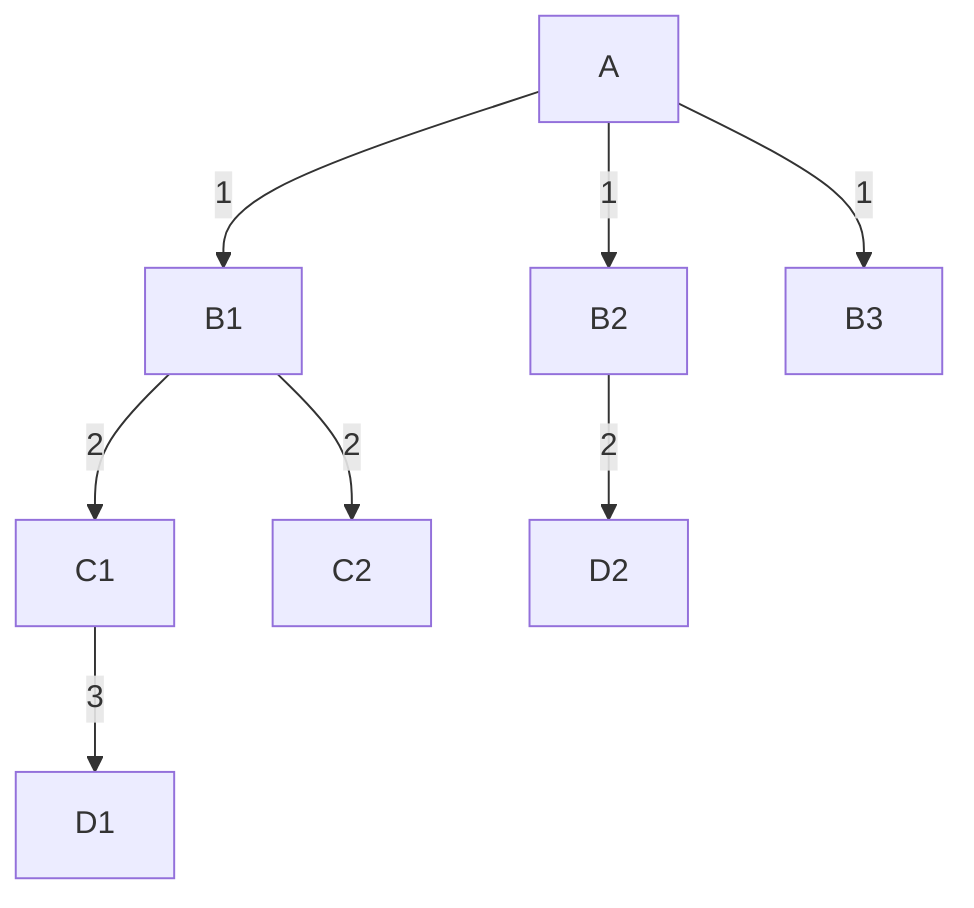
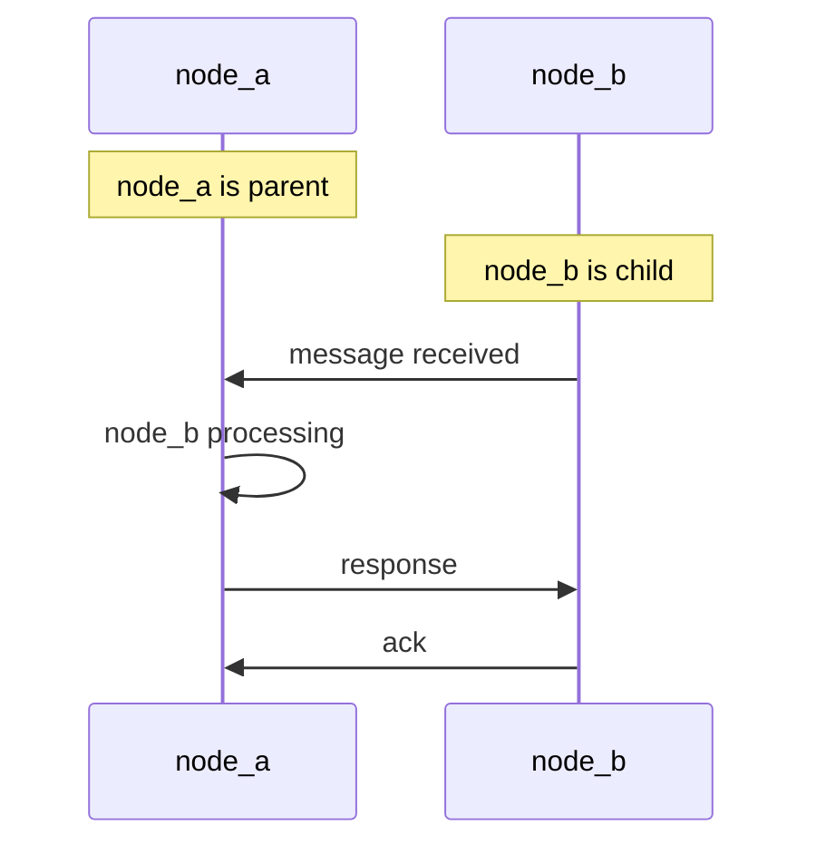
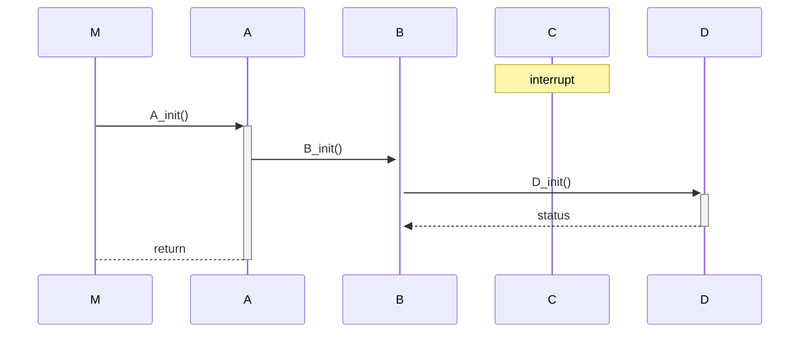

# Communication of two nodes

Tree diagram

```mermaid
   graph TD
   A -->|1| B1
   A -->|1| B2
   A -->|1| B3

   B1 -->|2| C1
   B1 -->|2| C2

   B2 -->|2| D2

   C1 -->|3| D1

```

Diagram below illustrates communication of two nodes a and b

```mermaid
  sequenceDiagram
     participant node_a
     participant node_b

     Note over node_a: node_a is parent
     Note over node_b: node_b is child


     node_b->>node_a : message received
     node_a->>node_a : node_b processing

     node_a->>node_b : response
     node_b->>node_a : ack
```

Sequence diagram

```mermaid
sequenceDiagram
    participant M as M
    participant A as A
    participant B as B
    participant C as C
    participant D as D
    note over C: interrupt
    M->>+A: A_init()
    A->>+B: B_init()
    B->>+D: D_init()
    D-->>-B: status
    A-->-M:return
```
